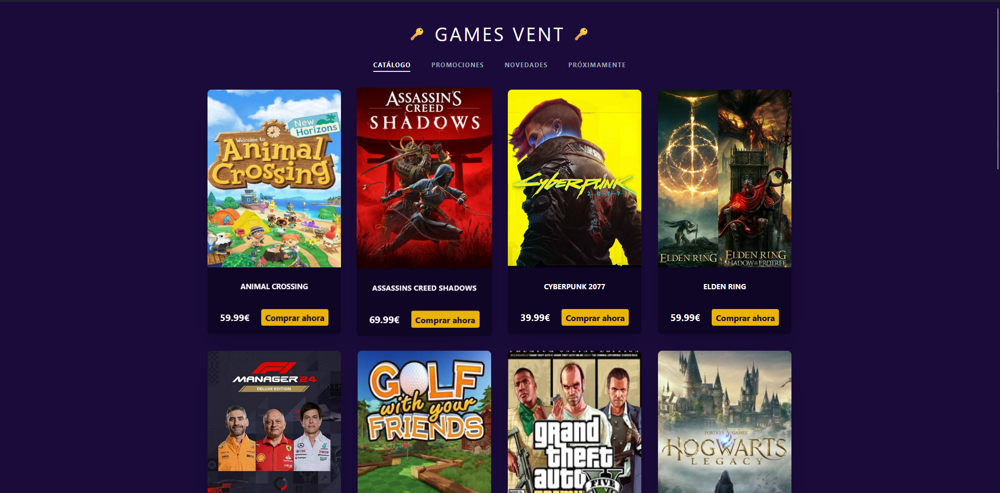
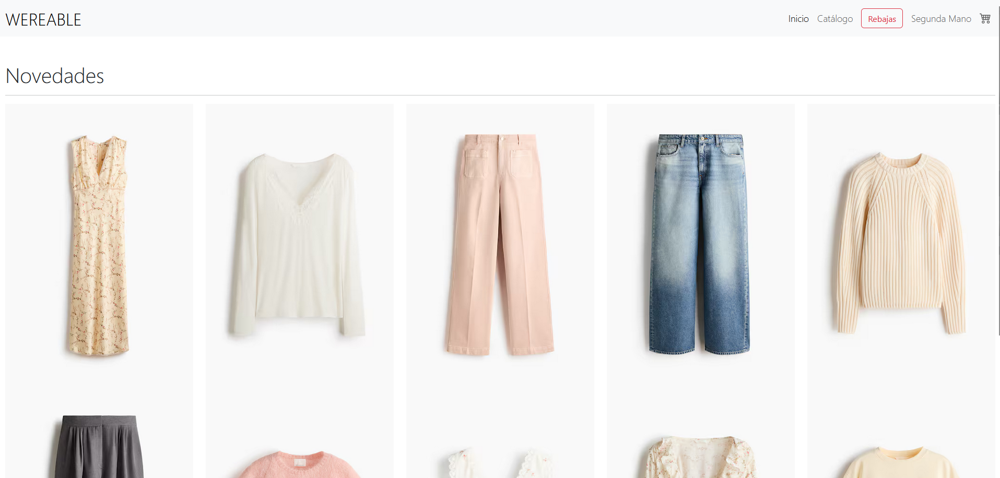
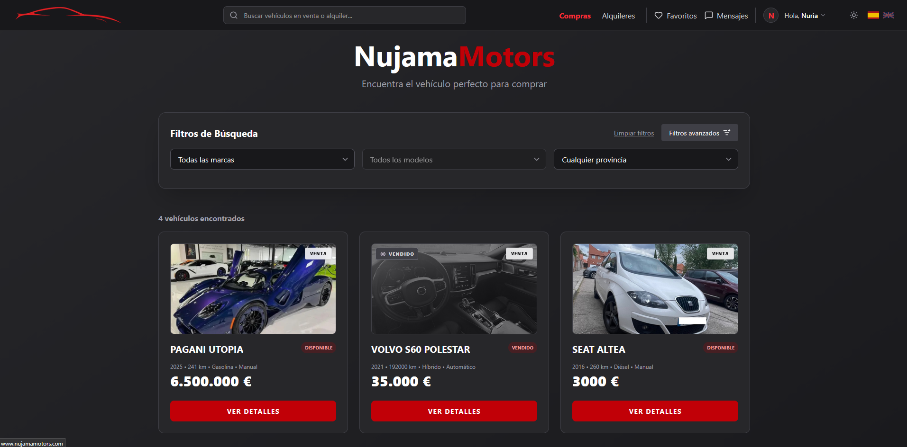

<!-- HEADER ANIMADO -->

<p align="center">
  
</p>

<h3 align="center">💻 Estudiante de desarrollo | Aprendiendo paso a paso</h3>

---

## 🌸 Sobre mí

```text
> Aprendiendo programación sin prisas pero sin pausa.
> Construyendo cosas, rompiendo cosas y entendiendo por qué se rompieron.
```

* 🎓 Estudiante de desarrollo
* 🧠 Aprendiendo bases de datos y programación
* 🌱 Mejorando cada día un poquito más
* ☕ El café y el debug van juntos

---

## 🚀 Proyectos destacados

<p align="center">
  <a href="https://github.com/NuriaPines/games-vent">
    
  </a>
</p>

### 🎮 Games Vent
Aplicación web centrada en videojuegos donde se trabaja el diseño de interfaz y la estructura de una web interactiva.

**Tecnologías:** HTML · CSS · JavaScript  
🔗 https://github.com/NuriaPines/games-vent

---

<p align="center">
  <a href="https://github.com/NuriaPines/Proyecto-Final-Diseno">
    
  </a>
</p>

### ⌚ Proyecto Final Diseño
Proyecto web enfocado en diseño y experiencia de usuario, desarrollando una interfaz moderna para una página de productos wearables.

**Tecnologías:** HTML · CSS · Diseño UI  
🔗 https://github.com/NuriaPines/Proyecto-Final-Diseno

---

### 📘 Book JavaScript Study
Repositorio de estudio con apuntes y ejercicios prácticos para aprender y reforzar conceptos de JavaScript.

**Tecnologías:** JavaScript  
🔗 https://github.com/NuriaPines/Book-JavaScript-Study

---

## 🤝 Proyectos en colaboración

## 🎓 Trabajo de Fin de Grado (TFG)

He desarrollado junto a dos compañeros una plataforma web orientada a la **compraventa y alquiler de vehículos**, como proyecto final del ciclo superior de **Desarrollo de Aplicaciones Web (DAW)**.

El proyecto consiste en un marketplace completo que permite a los usuarios publicar anuncios, gestionar vehículos, comunicarse mediante chat en tiempo real y administrar contenido desde un panel de control.

### 🚀 Tecnologías utilizadas

- React + TypeScript
- Vite
- Tailwind CSS
- Laravel / PHP
- PostgreSQL / MySQL
- API REST
- Google Drive API
- Git & GitHub

### ✨ Funcionalidades principales

- Gestión de anuncios de venta y alquiler
- Sistema de autenticación y usuarios
- Chat en tiempo real
- Sistema de favoritos y reseñas
- Panel de administración
- Internacionalización (i18n)
- Diseño responsive y moderno

Durante el desarrollo del proyecto se aplicaron conocimientos de arquitectura full stack, diseño de bases de datos relacionales, integración de APIs, desarrollo responsive y trabajo colaborativo mediante control de versiones.

📌 Proyecto finalizado y publicado en GitHub.

<p align="center">
  <a href="https://github.com/MartinezDelAlamoMarco/tfg_jmn_25_26">
    
  </a>
</p>

---

## 🔥 Racha de commits

<p align="center">
  
</p>

---

## 🌙 Actualmente...


* 📚 Practicando SQL y bases de datos para mejorar consultas, triggers y procedimientos  
* 🧩 Haciendo proyectos personales como **Games Vent** y **Proyecto Final Diseño**, aplicando diseño web, frontend y experiencia de usuario  
* 📝 Estudiando y creando material propio en **Book JavaScript Study** para reforzar JavaScript  
* 🎓 Trabajando en mi **TFG de DAW** (Desarrollo de Aplicaciones Web), proyecto colaborativo en fase privada que combina frontend, backend y base de datos  
* 🚀 Construyendo mi camino como desarrolladora, aprendiendo a organizar proyectos y a trabajar en equipo con Git/GitHub  
* ✨ Explorando nuevas tecnologías y buenas prácticas para aplicarlas en proyectos futuros

---

## 💫 Filosofía dev

```javascript
while (alive) {
  learn();
  practice();
  improve();
}
```

---

<p align="center">
  ✨ Perfil en construcción constante ✨
</p>

<p align="center">
  
</p>
